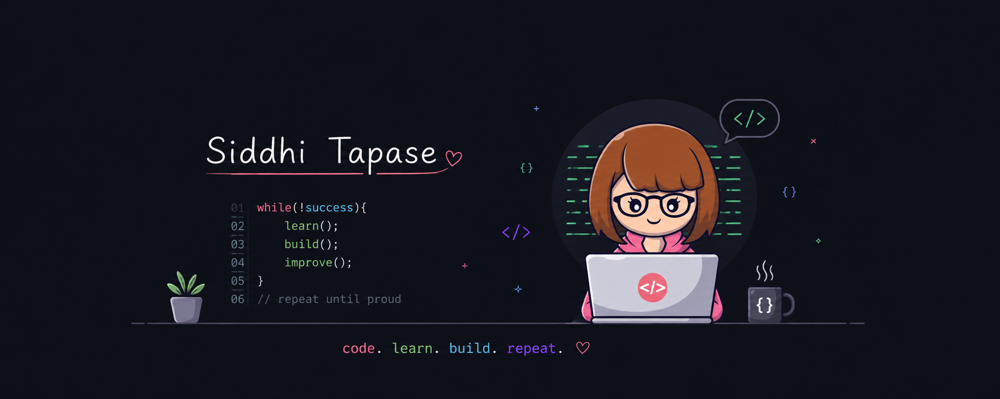

<h2>Hello there, </h2>

<h3>AI &amp; ML Developer | Gen AI Enthusiast | Cloud Computing</h3>

## 🚀 About Me

I'm a **Computer Science student** with a strong interest in **Artificial Intelligence, Machine Learning, and Generative AI**, and a growing focus on **Cloud Computing**.
I enjoy solving real-world problems through code, contributing to open-source projects, and constantly exploring how emerging tech — from LLMs to scalable cloud systems — can be applied to build meaningful solutions.
Always learning, always building. 🚀

---

## 🛠️ The Arsenal

**🔥 Languages & Core**

    

**🧠 AI/ML & Data Science**

   

Specialized: **LLMs (LLaMA, GPT)**, **RAG**, **ChromaDB**, **FAISS**, **NLP**, **Embedding Models**, **LangChain**

**⚡ Frameworks & Development**

   

**🛠️ Tools & Infrastructure**

   

---

## 📊 GitHub Stats

## 📈 Contribution Graph

## ⏳ Contribution Timeline

> ⚙️ Snake needs one-time setup — see below.

## 🔗 Connect With Me

---

